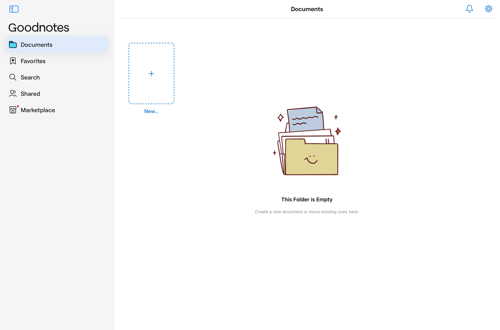
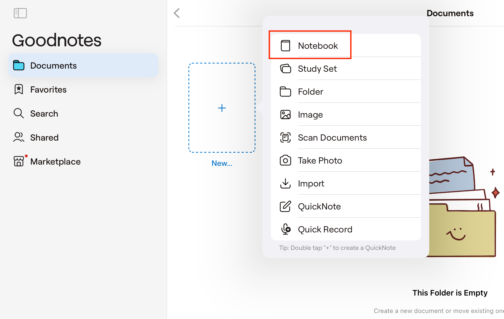
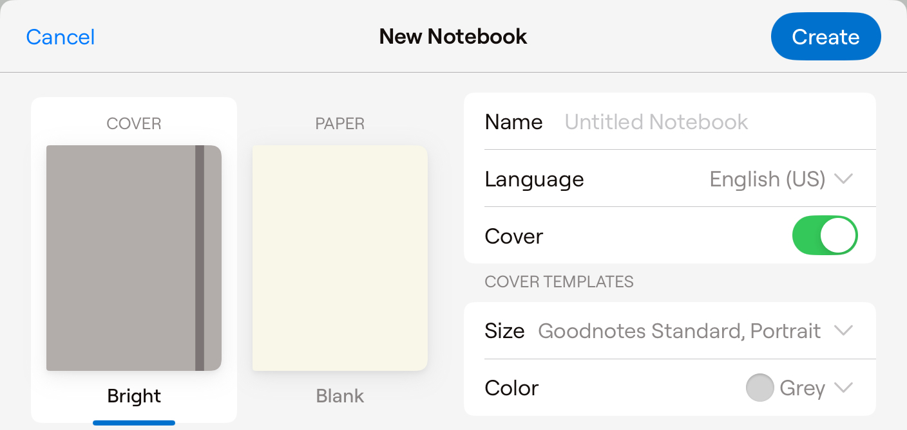
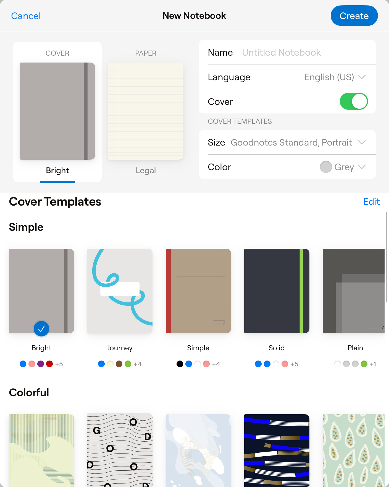
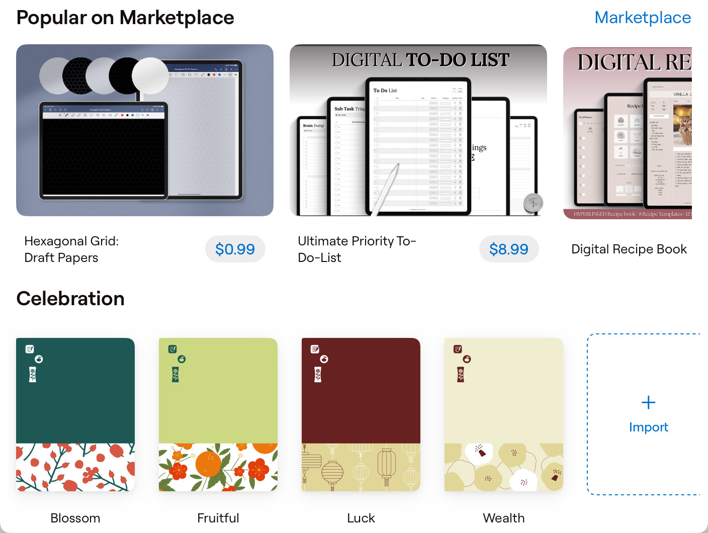
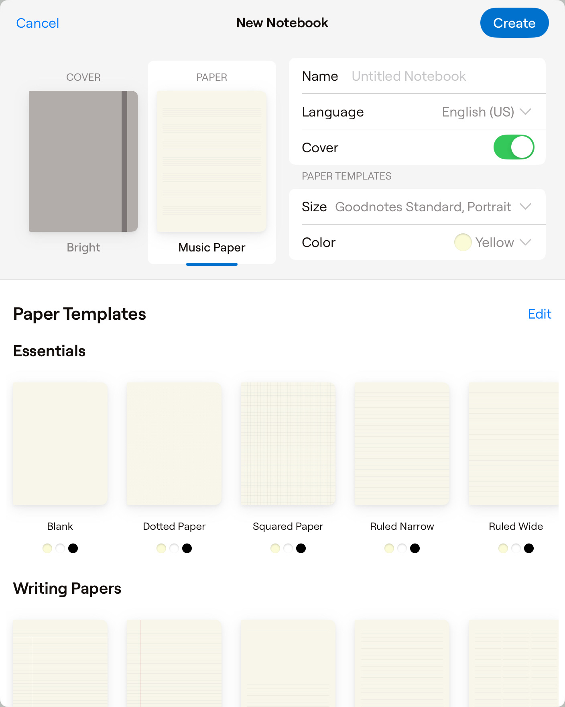
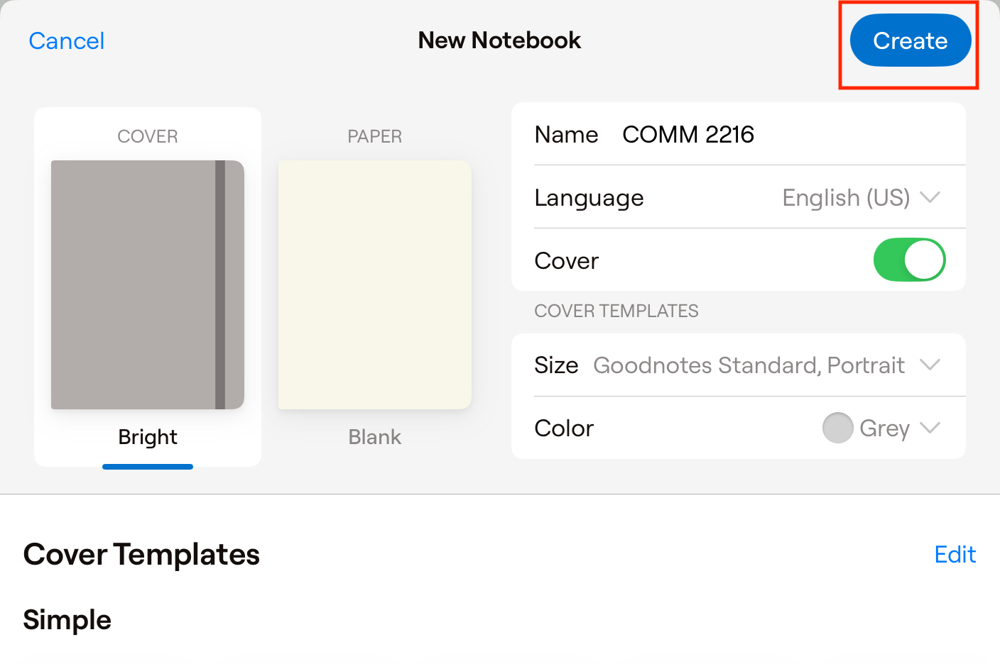
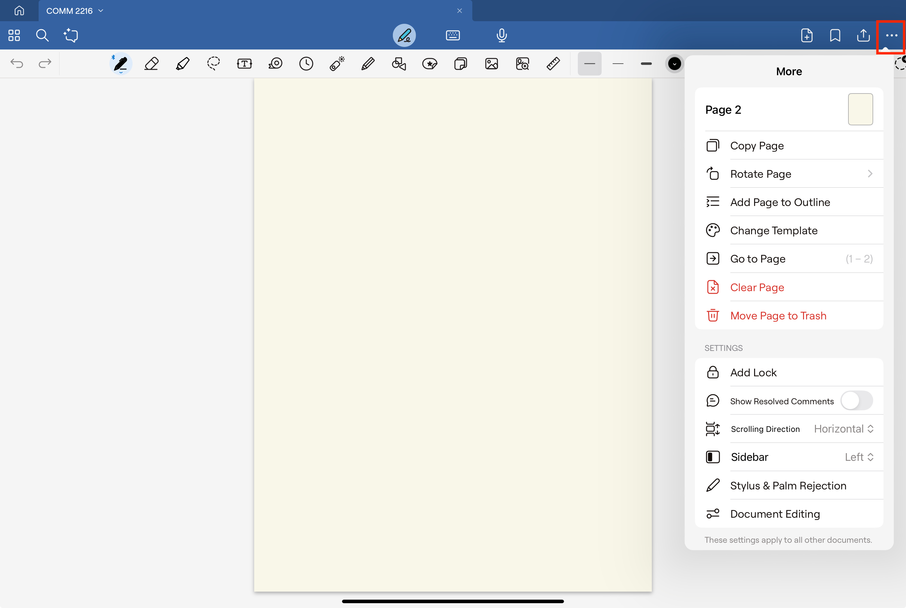
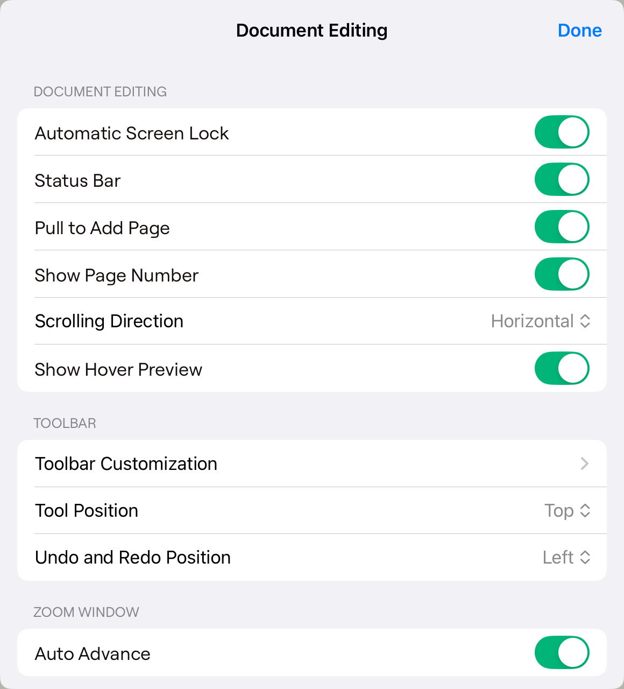

# Create and Customize New Notebook

## Overview
This guide explains how to create a new notebook in GoodNotes 6 and change its cover and page layout. This task is important for anyone starting with digital note-taking.

## Create a New Notebook

1. **Launch the App**

   When you open the GoodNotes 6 app, you'll see an empty Documents page that acts as your home screen. From here, you can begin creating new notebooks and folders in the [Documents] section.

    !!! note "Note"
        The Documents page is your default starting point. Take a moment to get familiar with its layout before you continue.

2. **Click the [+] Icon**

   Select the [Notebook] option from the top menu. The app offers several options, like creating a study set, folder, image note, scanned document, quick note, or quick record.

    !!! tip "Tip"
        If you plan to add notes right away, choose the option that best fits your needs.

3. **Configure Notebook Settings**

   Set up your notebook by adjusting these options:
      - [Name]: Enter the notebook title.
      - [Language]: Choose your preferred language.
      - [Cover Toggle]: Decide whether to include a cover.

    !!! note "Note"
        Make sure you enter the notebook name correctly, select the right language, and set the cover toggle as you want because these settings may be hard to change later.
    !!! tip
        A good cover not only makes your notebook look nice but also helps you keep it organized. Consider creating your own design if the default templates don’t match your taste.

4. **Choose a Cover Design**
    <figure markdown>
    {width="700"}
    </figure>
    Pick a cover design from the available templates.  
    <figure markdown>
    {width="700"}
    </figure>
   You can also import your own cover designs or visit the marketplace to buy one that suits your style. Each template offers a unique color scheme, and you can choose from different sizes (e.g., A4 or Letter).

    !!! tip
        A good cover not only makes your notebook look nice but also helps you keep it organized. Consider creating your own design if the default templates don’t match your taste.

5. **Select a Paper Template**

    <figure markdown>
        {width="700"}
    </figure>
    Choose a layout for your notebook pages. Options include essentials, lined paper, music sheets, and planners.

    !!! note "Note"
        The paper template you choose will affect the look and use of your pages, so pick one that suits your purpose.

6. **Save the Notebook**
    <figure markdown>
        {width="700"}
          <figcaption>Example: Notebook Name – COMM 2216</figcaption>
    </figure>
    Click the [Create] button to save your new notebook.

    !!! success
        Your new notebook has been created successfully! Review all settings carefully before saving to ensure everything is correct.

## Customize Your Notebook

Make your notebook more personal by adjusting settings like scrolling direction, toolbar layout, palm rejection for the stylus, and sensitivity.

1. **Access Additional Options**

   Click the [...] icon to see extra customization settings. This menu shows options such as current page info, rotation, and template changes.

    !!! note "Note"
        Exploring these extra options can help you tailor your notebook to your liking.

    !!! tip "Tip"
        Left-handed users should adjust the writing posture for a more comfortable experience.

    !!! Warning "Warning"
        Incorrect posture settings may cause recognition errors, so your handwriting might not display correctly.
        

2. **Select Document Editing Options**

   Scroll down to [Settings] and choose [Document Editing].
    <figure markdown>
        {width="700"}
    </figure>
   Turn the options on or off based on your needs.
