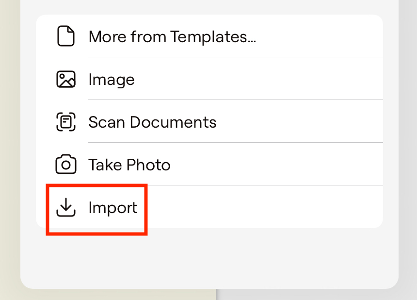
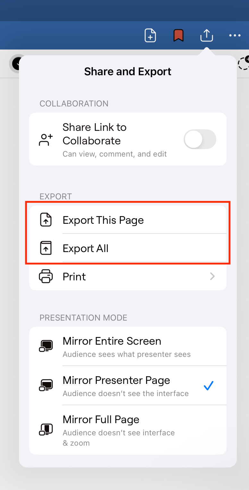

# Import and Annotate a PDF Document

## Overview
This section guides you through the process of importing a PDF document into GoodNotes and annotating it. This feature is ideal for students, professionals, or anyone who needs to mark up documents effectively.

## Import a PDF Document

There are two methods to import a PDF:

### Method 1: Import into an Existing Notebook

1. **Open an Existing Notebook**  
   
   Launch the GoodNotes app and open the notebook where you want to add the PDF.

    !!! note "Note"
        Ensure the notebook is set up and organized before importing a new document.

2. **Add a New Page**  
   
   Click the **Add Icon** (located at the top-right) to add a new page.

3. **Select the Insertion Point**  
   
      Choose whether to insert the new page before, after, or at the end of the notebook.

    !!! tip "Tip"
         Selecting the correct insertion point helps maintain the document's flow.

4. **Choose the “Import” Option**  
   
   In the menu that appears, select the **“Import”** option.

### Method 2: Import as a New Document

1. **Click the ‘+’ Icon**  
   
   On the home screen, click the **‘+’** icon to create a new document.

2. **Select the “Import” Option**  
   
   Tap the **“Import”** button from the menu.
   
    !!! tip "Tip"
        Importing as a new document creates a standalone PDF file, ideal for dedicated storage.

### Continue the Import Process

5. **Choose a File or Files to Import**  
   
   Navigate through your file explorer and select the desired PDF file.

6. **Tap “Open”**  

   Confirm your selection by tapping **“Open”**.  
   

    !!! success "Success"
        Your PDF has been imported and is now ready for annotation.

## Activate Annotation Tools

1. **Activate Annotation Tools**  

   From the top menu, select tools such as **Pen**, **Highlighter**, or **Eraser**.

2. **Adjust Pen Settings**  

   Choose your preferred pen type (fountain pen, ballpoint, or brush pen) and enable stroke stabilization if needed.
   
    !!! note "Note"
        Customize your pen settings to match your writing style for optimal results.

## Annotate the Document
   Use the active annotation tools to mark up your document: Write, highlight, or underline text as needed.

1. **Add Bookmarks**  

   Tap the bookmark icon (represented by a ribbon) on the toolbar to bookmark the current page.

   
   To view or manage bookmarks, open the bookmark sidebar, where all your bookmarks are listed.

2. **View and Add Outlines**  

   If your imported PDF includes a built-in outline, GoodNotes will display it in the sidebar.  
   
   If no outline exists, you can manually create one by using the text tool to add a table of contents or annotating a dedicated page to serve as your custom outline.
     

    !!! tip "Tip"
        Using different colors or pen types for bookmarks and outline entries can help differentiate them and improve document navigation.

## Export the Annotated PDF

1. **Export the Annotated PDF**  

Click the **“Share and Export”** icon and select the export options.  

Choose whether to export the current page or all pages.
    
    !!! success "Success"
        Your annotated PDF is now ready for sharing or backup.
