# Utilizing Advanced AI-Powered Features

## Overview
GoodNotes offers AI-powered capabilities to enhance your productivity and help you stay organized. In this section, you will learn how to:

- Convert handwritten math equations into computed results.
- Search your handwriting for keywords.
- Use real-time spelling correction.

By following these instructions, you will be able to maximize GoodNotes 6’s intelligent tools for a smarter, more productive workflow.

## Convert Handwritten Math Equations

1. **Open an Existing or New Notebook**
   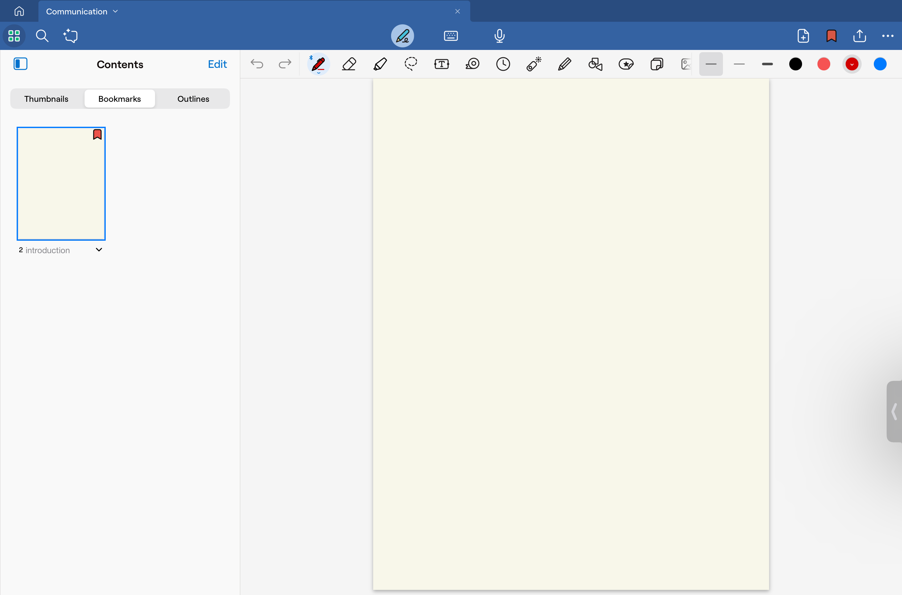 
   Launch the GoodNotes app and choose the notebook you want to use.
   
    !!! warning
        Make sure you have enough space or a blank page to write your equation.

2. **Write a Mathematical Expression**
<figure markdown>
   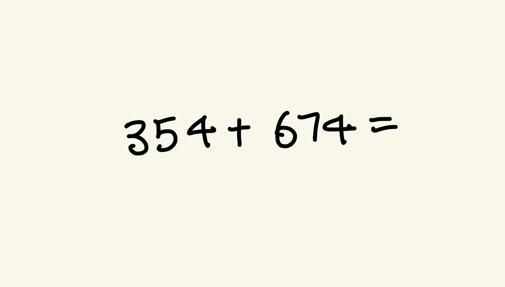{width="700"}
</figure>
   We are going to try a simple addition. In the blank space, write down `354 + 674 =`.

!!! warning
    GoodNotes cannot interpret an equation if you forget to include an equals sign `=` on the right side of the expression. For example, `5 - 2` without an equals sign or with the sign placed underneath the expression will not be detected.
    <figure markdown>
       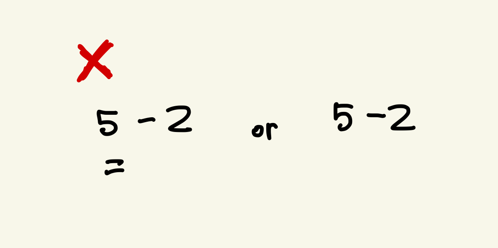{width="700"}
    </figure>

3. **Wait for the Equation to Be Highlighted**
    <figure markdown>
       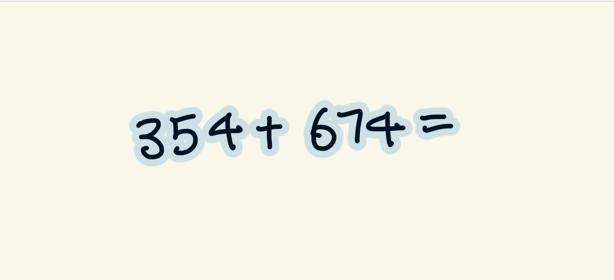{width="700"}
    </figure>  
     
    GoodNotes automatically detects your handwritten equation and highlights it in light blue. The highlight slowly flashes to indicate that further action is required.

4. **Tap the Highlighted Equation and Select [Solve]**
    <figure markdown>
        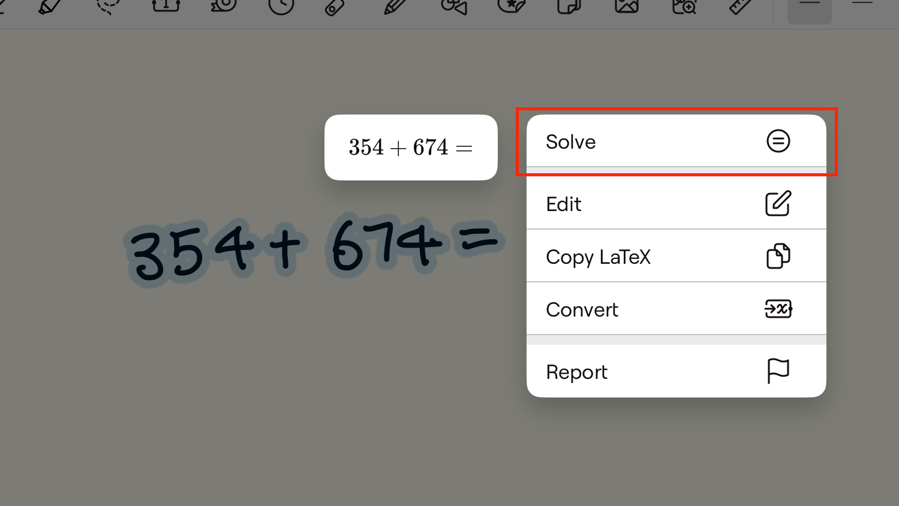{width="700"}
    </figure>  
        
    GoodNotes will compute and display the result.

    !!! note
        You have other options for the equation as well. You can manually edit it with the digital keypad, copy or convert it into typed text.

        <figure markdown>
            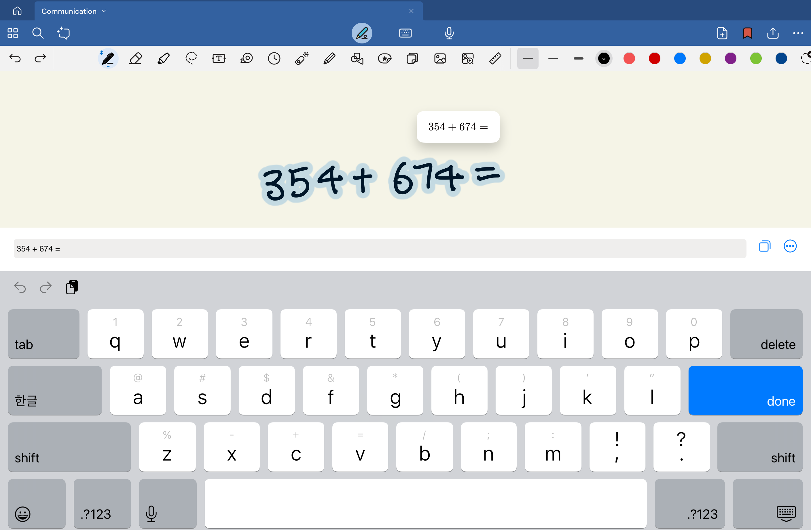
            <figcaption>Edit your expression.</figcaption>
        </figure> 

        <figure markdown>
            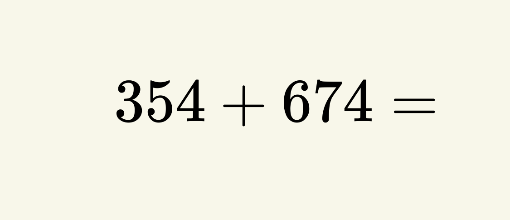{width="700"} 
            <figcaption>Convert your expression into typed text.</figcaption>
        </figure>  

    !!! tip
        Imagine your math assignment asking you to express the answer in different formats. GoodNotes gives you options! You can convert `3/2` into a mixed fraction (`1 1/2`) or a decimal (`1.5`).
        <figure markdown>
            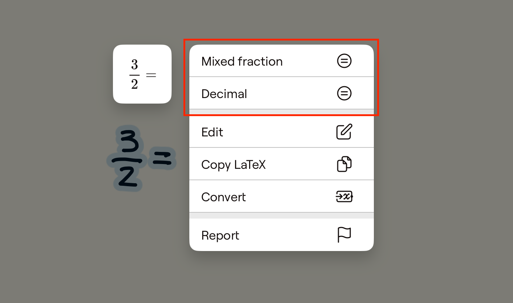{width="700"} 
        </figure>  

5. **Write Over the Computed Answer**
    <figure markdown>
        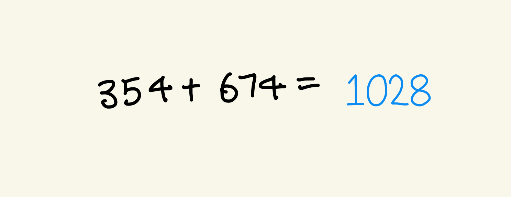{width="700"} 
    </figure> 
    <figure markdown>
           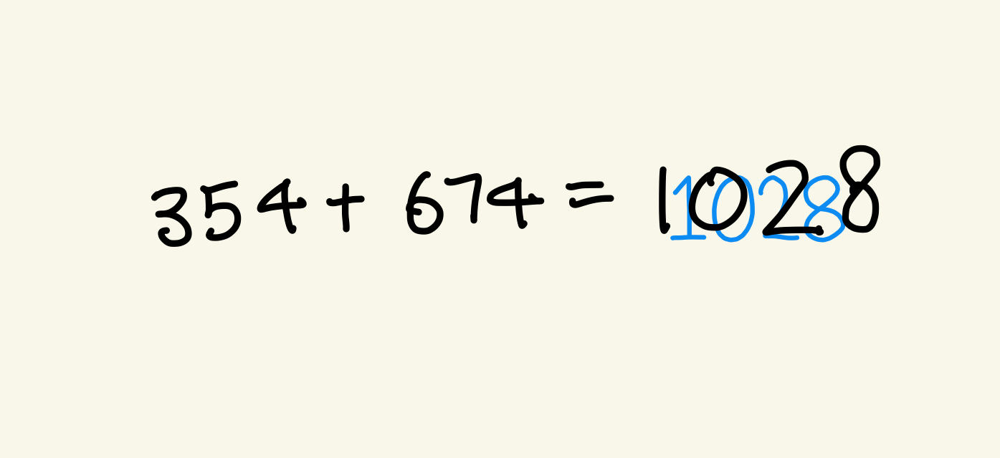{width="700"} 
    </figure> 
    <figure markdown>
           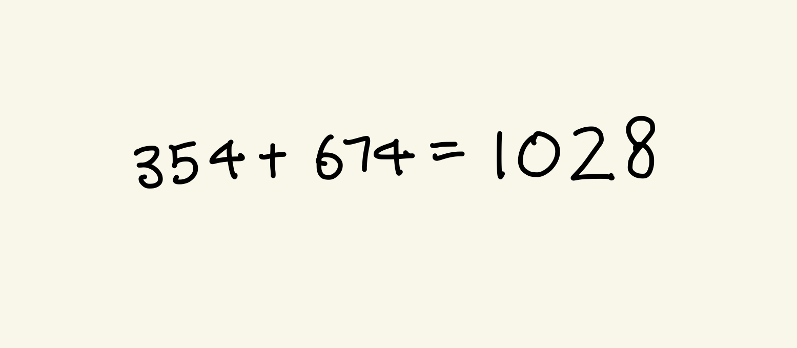{width="700"} 
    </figure> 
   The computed answer appears in blue. Simply write over it to replace it with your own text.

    !!! note
        The suggested answer remains visible until GoodNotes detects new writing. Once you start writing or move on, it disappears after a delay.

    !!! success
        Your equation is now solved! Enjoy referencing or customizing the computed result as needed.

## Search Your Own Handwriting for Keywords

1. **Open an Existing or New Notebook** 

	Choose the notebook you want to use. Make sure you either have enough space to write or a notebook that contains some handwritten text you want to search.
	
	!!! note 
		If you already have the keyword written, proceed to **Step 3**. If you would like to start fresh, proceed to **Step 2**.

2. **Write a Keyword** 

	Write a keyword, `midterm`, in the blank space using your natural handwriting style.
	
	!!! note 
		Imagine your instructor mentioned in a Java class that a certain topic will be on the midterm exam. You can search for the “midterm” keyword to mark important exam topics and refer back to them as needed.

3. **Tap the [Search Icon]**
   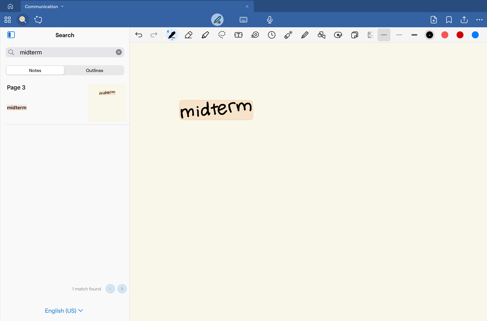  
  	In the toolbar, tap the [Search icon] in the top-left corner, then enter your keyword.

    !!! tip
        You can use your Apple Pencil or stylus to write directly into the search bar.

4. **Review the Search Results**

	GoodNotes displays page thumbnails with your keyword highlighted. Select the page you want to open. You can toggle between [Notes] and [Outlines] to refine your search.

## Use Real-Time Spelling Correction

1. **Open an Existing or New Notebook**

	Continue in the same notebook or create a new one.

2. **Write a Commonly Misspelled Word**  

	Write `Recive` instead of `Receive` in your natural handwriting. GoodNotes underlines the misspelled word in red.

3. **Tap the Underlined Word to See Suggestions**  

    <figure markdown>
        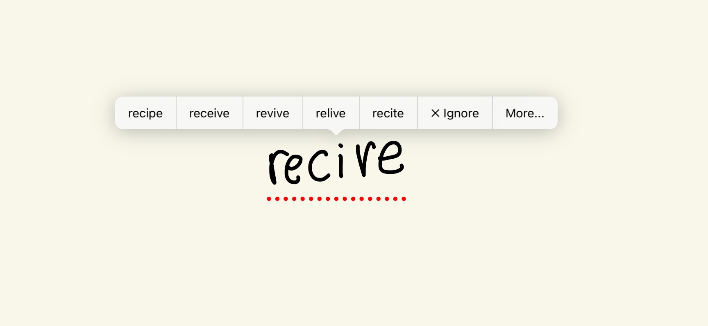{width="700"}
    </figure>
    GoodNotes will provide suggestions for the word you intended to write.
	
4. **Choose the Correct Spelling to Replace the Misspelled Word**

    GoodNotes will analyze your handwriting and rewrite it in a style that matches your own.  
    <figure markdown>
        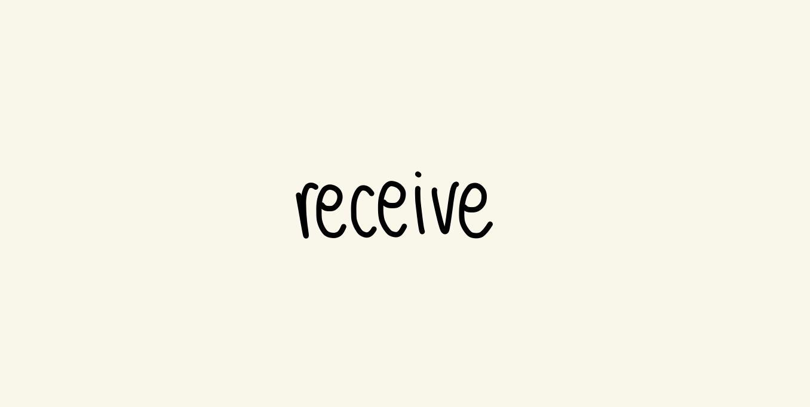{width="700"}
    </figure>

    !!! warning
        Extremely stylized handwriting may not be recognized. Write as clearly as possible for the best results.